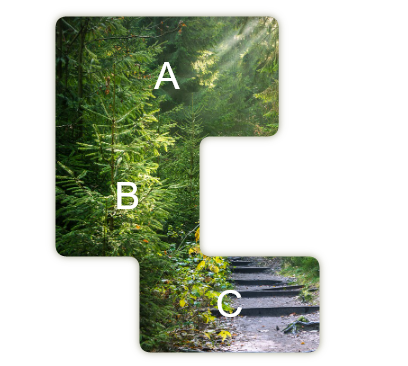
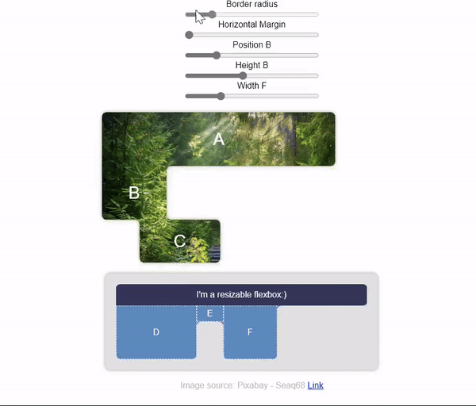
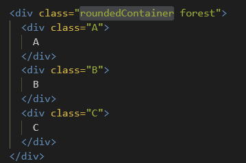

# Wobbly-shapes readme

### Hello!

I made this script because I saw a lot of interesting Figma designs using these shapes -> however, they are tedious to make with plain CSS.

With this javascript file you can create complex curved shapes from multiple divs, with inverted borders;

Try it here: [A Pen by AleidS (codepen.io)](https://codepen.io/aleids/pen/MWdoVee)

**How to:** 

Copy script.js into your project and link it

Makes sure to include these jquery libraries as well;

``

`<link rel="stylesheet" type="text/css" href="https://cdnjs.cloudflare.com/ajax/libs/jqueryui/1.12.1/jquery-ui.css">`

 ``

Then simply place your shapes in a div with class name 'roundedContainer' and relative or absolute positioning:

It will create an svg clip-path around this parent div, following the shapes of the inner divs, retaining it's background color or background image. It should also implement its border radius around all the corners of the clipping path.

#### Please note:

shapes should be adjacent, not overlapping.

having both a top/bottom border or both a left/right border on inner divs, might cause problems. One on each side should be fine

if you use borders on the inner divs,

add;

    -box-sizing: border-box;

    -moz-box-sizing: border-box;

    -webkit-box-sizing: border-box;

to the CSS, so that they are considered in their sizes. 

#### Troubleshooting and editing code

Refer to script.js and comments
helpful to console.log the path that's being created and the points observed by the script

#### Workings

1. Collects all corner points from inner divs
2. Picks top/left div, draws a path around it counter-clockwise
3. For each line, it consideres if there are adjacent divs (with points on that same line), with points that are encountered sooner than a point on the current div
4. If so, path goes around that div first, again counter-clockwise and repeats step 3 for every line
5. Untill path reaches the starting point
6. Then, for each point on the line, 100 points are added to create a border radius with a bezier curve (borrowed code), either a normal or an inverted one, depending on wether the point lies on 1 div or 2. (with 2 getting an inverted border)
7. this new path is used to draw an SVG clip-path

(Refer to comments in the JS file for more precise explanations)

#### Possible Future Extensions

* It would be interesting to mask multiple groups of divs within the same parent container, thus with a compound clipping path, which should be possible with the svg paths. Would be quite useless if all of these divs had the same background color however -> or we might want a margin between these divs, in a grid for example.
* Would be interesting to add an absolute positioned div with a certain color for the shape, rather than cut the original shape, and then give the option to include/exclude certain shapes (for example for a menu, where you might want to dynamically include/exclude tabs)
