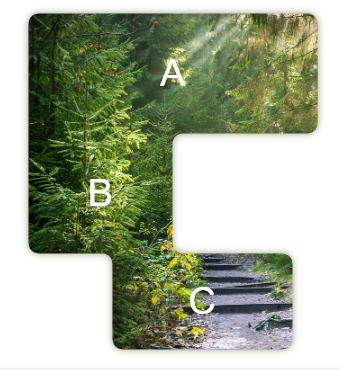
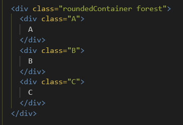

Hello!

With this javascript file you can create complex curved shapes from multiple divs, with inverted borders;

simply place your shapes in a div with classname 'roundedContainer' and relative or absolute positioning:

it will create an svg clip-path around your parent div, retaining it's background color/image. It should also implement its border radius around all the corners of the clipping path.

Please note:

shapes should be adjacent, not overlapping.

if you use borders on the inner divs,

add;

   box-sizing: border-box;

    -moz-box-sizing: border-box;

    -webkit-box-sizing: border-box;

to the CSS
#� �w�o�b�b�l�y�-�s�h�a�p�e�s�
�
�
